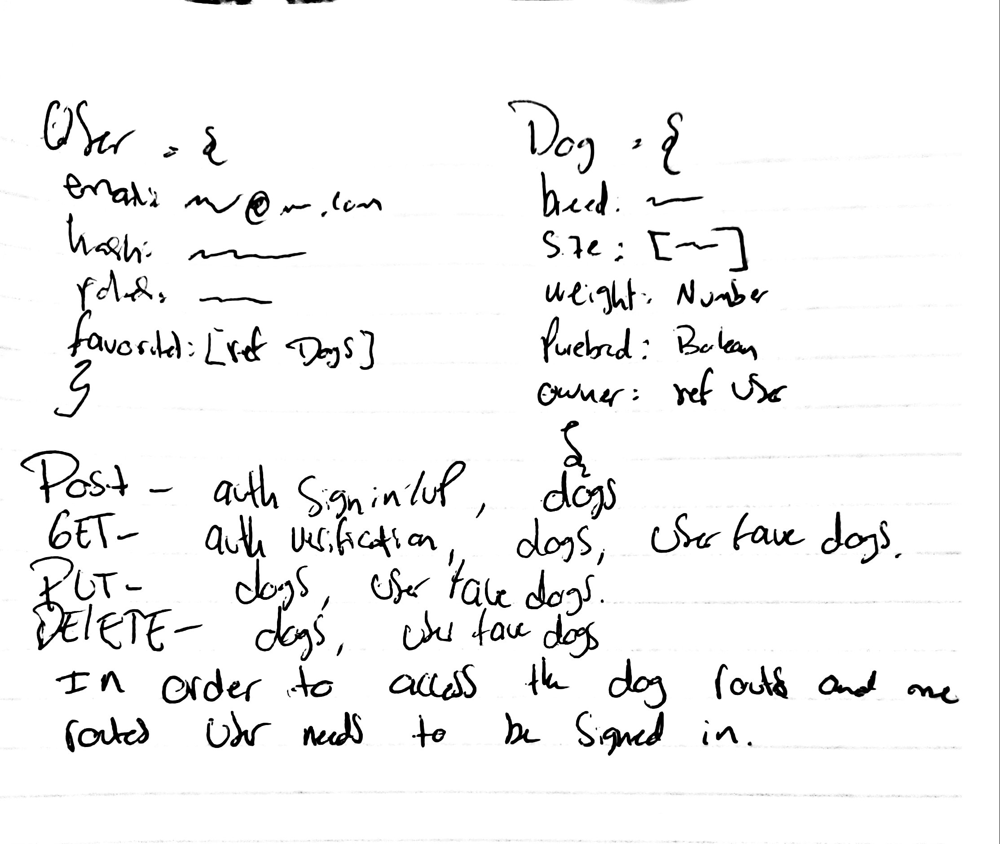

# lab-10

## User Management and Auth

### Author: Antonella Gutierrez

### Links and Resources
* [submission PR](https://github.com/antonella-401-advanced-javascript/lab-10/pull/1)
* [travis](https://travis-ci.com/antonella-401-advanced-javascript/lab-10/builds/130353726)

###  API Server
Create server that allows user sign-up, and enforces
access to routes based on user identity.
* routing
	* method based functions (`app.get`)
	* response.send and response.json
	* order
	* parameters (route and query)
		* request
	* `app.use()`
* project structure
	* views, routes
	* express generator
	* `express.Router()`

### Models
Models (Entities/Resources)
* User
  * stores the `hash` from password 
  * has a method to validate correct password
* Dog
  * has an `owner` property of type `ObjectId` with a ref to `User` model

### Middleware
* Parameters
* Route handling
  * Router object
* Middleware error handling

### Routes
auth router
1. `POST /api/auth/signup`
1. `POST /api/auth/signin`
1. `GET /api/auth/verify`

me router
1. `GET /api/me/favorites`
1. `PUT /api/me/favorites/dogId`
1. `DELETE /api/me/favorites/dogId`

dog router
1. `POST /api/dogs`
1. `PUT and DELETE` `/api/dogs/:id`
1. `GET /api/dogs`

### Setup
#### .env requirements
* MONGODB_URI - mongodb://localhost:27017/management
* PORT - 3000
#### Running the app
* npm start
* npm start:watch
#### Tests
* Unit Tests: npm test
* Lint Tests: npm run lint
#### UML
